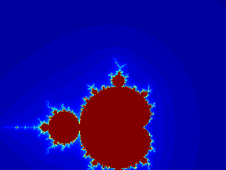

# The Mandelbrot set
> Growing up some music videos used to have endless zoomed fractal patterns which did not make sense at that time until
> I later on learnt complex numbers in high school. When just randomly watching youtube videos I encountered the mandelbrot set
> which really reminded me of the good old days and I was challenged to implement it in rust as my journey of learning rust
> See the gif below for a better idea of what I mean.

Using the num crate to use its complex submodule

A black and white madelbrot set will be used to display a simple CLI set.

## Params used
* max_iters: to denote the maximum depth of iteration to check for stability of a value set to 1000
* x_min and x_max: to denote the start and end of the search for the set in Real axis(Re)
* y_min and y_max: to denote the start and end of the search for the set in the imaginary axis(Im)
* width: the width of the set
* height: the height of the set

## How it works
It uses 3 main functions:
* mandelbrot_at_point - called at every point to determine if it is in the set or not
* calculate_mandelbrot - converts between the output space and a range that surrounds the mandelbrot set.
* render_mandelbrot - uses various ascii characters to represent the mandelbrot set

An output txt file containing the mandelbrot set is generated once the program is run
Please check it out [mandelbrot.txt](mandelbrot.txt)